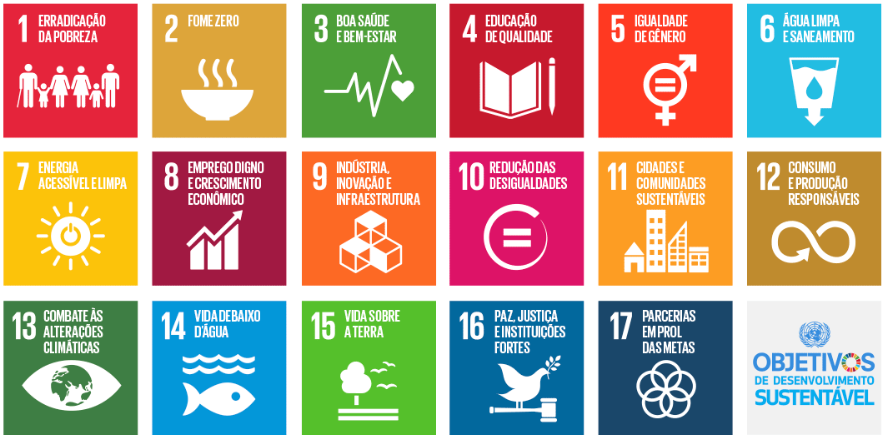

# Fase 1 - Propósito da Avaliação

## Introdução

Este documento apresenta o propósito da avaliação de qualidade do sistema [AGIO (Aplicação de Gestão de Inventário Otimizada)](https://github.com/unb-mds/2024-2-Agio), tomando como base o modelo de qualidade **ISO/IEC 25010**. A avaliação foi estruturada a partir das características previamente definidas no escopo da Fase 1, com foco em **Confiabilidade** e **Adequação Funcional**, bem como em suas respectivas subcaracterísticas selecionadas.

O objetivo desta etapa não é realizar uma análise completa de todas as características previstas pelo modelo SQuaRE, mas sim concentrar a investigação nos aspectos considerados mais relevantes para o contexto atual do sistema AGIO e para os objetivos definidos pela disciplina de Qualidade de Software.

---

## Propósito da Avaliação

A avaliação busca identificar se o sistema executa corretamente suas funcionalidades essenciais e se mantém um comportamento operacional minimamente estável durante sua utilização. Dessa forma, pretende-se investigar tanto a presença e completude das funções implementadas quanto a ocorrência de falhas, inconsistências e comportamentos inesperados observados durante a execução do sistema.

Os resultados obtidos poderão ser utilizados pela equipe responsável pelo projeto para apoiar decisões relacionadas à:

- identificação de falhas funcionais;
- verificação da corretude das funcionalidades implementadas;
- análise da estabilidade operacional do sistema;
- priorização de correções;
- compreensão das limitações técnicas presentes na versão atualmente analisada do AGIO.

---

## Escopo da Avaliação

A avaliação foi delimitada exclusivamente às características de **Confiabilidade** e **Adequação Funcional**, conforme estabelecido no documento de Modelo de Qualidade e Escopo da Fase 1.

Dentro dessas características, foram selecionadas apenas as subcaracterísticas consideradas mais adequadas ao contexto atual do AGIO e às limitações observadas durante a análise do ambiente.

### Confiabilidade

Para a característica de Confiabilidade, foram selecionadas as seguintes subcaracterísticas:

- **Maturidade**
- **Tolerância a Falhas**

### Adequação Funcional

Para a característica de Adequação Funcional, foram selecionadas as seguintes subcaracterísticas:

- **Completude Funcional**
- **Correção Funcional**
- **Pertinência Funcional**

---

## Limites da Avaliação

Os resultados apresentados nesta avaliação refletem exclusivamente o comportamento observado na versão do sistema disponível durante o período de análise.

Alterações futuras no código-fonte, correções de bugs, mudanças estruturais ou modificações nas funcionalidades poderão invalidar parcialmente os resultados obtidos nesta etapa.

Além disso, devido às limitações do ambiente atualmente disponibilizado do AGIO, determinadas métricas e análises previstas pelo modelo ISO/IEC 25010 não puderam ser incluídas no escopo desta fase.

---

# ODS Relacionadas ao Projeto AGIO

Os Objetivos de Desenvolvimento Sustentável (ODS) foram estabelecidos pela Organização das Nações Unidas (ONU) em 2015 como parte da Agenda 2030, um plano de ação global composto por 17 objetivos que buscam promover o desenvolvimento sustentável em suas dimensões social, econômica e ambiental.

Os ODS fornecem diretrizes para que governos, instituições e organizações desenvolvam iniciativas capazes de contribuir para a construção de uma sociedade mais inclusiva, inovadora e sustentável. Nesse contexto, projetos de software também podem gerar impactos positivos ao promover educação, desenvolvimento tecnológico, inovação e qualificação profissional.

Dessa forma, o projeto AGIO (Aplicação de Gestão de Inventário Otimizada) apresenta alinhamento com alguns dos Objetivos de Desenvolvimento Sustentável, especialmente aqueles relacionados à educação de qualidade, ao desenvolvimento de competências profissionais e à promoção da inovação tecnológica. As ODS identificadas como mais aderentes ao contexto do projeto são apresentadas a seguir.

<strong>Imagem 1: Objetivos de Desenvolvimento Sustentável</strong>

<em>Fonte: <a href="https://gtagenda2030.org.br/ods/">GT Agenda 2030</a></em>

## ODS 4 — Educação de Qualidade

O AGIO possui relação com o ODS 4 por ser um projeto acadêmico desenvolvido na Universidade de Brasília (UnB), proporcionando aos estudantes experiências práticas relacionadas ao desenvolvimento de software, aplicação de modelos de qualidade, colaboração em equipe, versionamento e documentação técnica.

Além disso, o projeto contribui para o desenvolvimento de competências técnicas e profissionais relevantes para a formação acadêmica e inserção no mercado de trabalho, alinhando-se às seguintes metas:

- **ODS 4.3 –** Até 2030, assegurar a igualdade de acesso para todos os homens e mulheres à educação técnica, profissional e superior de qualidade, a preços acessíveis, incluindo universidade.
- **ODS 4.4 –** Até 2030, aumentar substancialmente o número de jovens e adultos que tenham habilidades relevantes, inclusive competências técnicas e profissionais, para emprego, trabalho decente e empreendedorismo.

---

## ODS 8 — Trabalho Decente e Crescimento Econômico

O AGIO possui relação com o ODS 8 por proporcionar aos estudantes experiências práticas em desenvolvimento de software, testes, documentação e avaliação de qualidade, contribuindo para a formação de profissionais mais preparados para atuar no mercado de trabalho.

Além disso, o projeto incentiva a aplicação de soluções tecnológicas para otimização de processos organizacionais, promovendo a inovação e o desenvolvimento de competências técnicas relevantes para a empregabilidade e produtividade, alinhando-se às seguintes metas:

- **ODS 8.2 –** Atingir níveis mais elevados de produtividade, por meio da diversificação e com agregação de valor, modernização tecnológica, inovação, gestão, e qualificação do trabalhador; com foco em setores intensivos em mão-de-obra.
- **ODS 8.6 –** Alcançar uma redução de 3 pontos percentuais até 2020 e de 10 pontos percentuais até 2030 na proporção de jovens que não estejam ocupados, nem estudando ou em formação profissional.
  
---

## ODS 9 — Indústria, Inovação e Infraestrutura

O AGIO relaciona-se ao ODS 9 por incentivar a utilização de soluções tecnológicas para informatização e organização de processos de inventário, além de estimular práticas de desenvolvimento colaborativo por meio de seu caráter open source.

O projeto também promove a aplicação de conhecimentos de engenharia de software e o desenvolvimento de soluções inovadoras, estando alinhado às seguintes metas:

- **ODS 9.5 –** Fortalecer a pesquisa científica e melhorar as capacidades tecnológicas das empresas, incentivando, até 2030, a inovação, visando aumentar o emprego do conhecimento científico e tecnológico nos desafios socioeconômicos nacionais e nas tecnologias socioambientalmente inclusivas; e aumentar a produtividade agregada da economia.
- **ODS 9.b –** Apoiar o desenvolvimento tecnológico, a pesquisa e a inovação nacionais, por meio de políticas públicas que assegurem um ambiente institucional e normativo favorável para, entre outras coisas, promover a diversificação industrial e a agregação de valor às commodities.

---

## Referências Bibliográficas

> ISO. ISO/IEC 25010 — ISO 25000 Software and Data Quality. Disponível em: <https://iso25000.com/index.php/en/iso-25000-standards/iso-25010> . Acesso em: 19 mai. 2026.
>
> ORGANIZAÇÃO DAS NAÇÕES UNIDAS. Objetivos de Desenvolvimento Sustentável: Disponível em: <https://brasil.un.org/pt-br/sdgs> . Acesso em: 19 mai. 2026.
> 
> Instituto de Pesquisa Econômica Aplicada (IPEA). <b>ODS 4 – Educação de Qualidade</b>. Disponível em: <https://www.ipea.gov.br/ods/ods4.html>. Acesso em: 18 jun. 2026.
> 
> Instituto de Pesquisa Econômica Aplicada (IPEA). <b>ODS 8 – Trabalho Decente e Crescimento Econômico</b>. Disponível em: <https://www.ipea.gov.br/ods/ods8.html>. Acesso em: 18 jun. 2026.
> 
> Instituto de Pesquisa Econômica Aplicada (IPEA). <b>ODS 9 – Indústria, Inovação e Infraestrutura</b>. Disponível em: <https://www.ipea.gov.br/ods/ods9.html>. Acesso em: 18 jun. 2026.

---

## Histórico de Versão

| ID | Descrição | Autor | Data | Revisor | Data |
|:--:|:-----------|:------|:------|:---------|:------|
| 01 | Criação inicial do documento | [Tiago Lemes](https://github.com/TiagoTeixeira-2005) | 11/05/2026 | [Letícia Monteiro](https://github.com/LeticiaMonteiroo) | 13/05/2026 |
| 02 | Desenvolvimento do conteúdo inicial do propósito da avaliação | [Letícia Monteiro](https://github.com/LeticiaMonteiroo) | 13/05/2026 | [Tiago Lemes](https://github.com/TiagoTeixeira-2005) | 13/05/2026 |
| 03 | Reestruturação do documento com alinhamento ao modelo ISO/IEC 25010 e ao documento de Modelo de Qualidade e Escopo | [Letícia Monteiro](https://github.com/LeticiaMonteiroo) | 19/05/2026 | [Tiago Lemes](https://github.com/TiagoTeixeira-2005)  | 19/05/2026 |
| 04 | Atualização das ODS | [Tiago Lemes](https://github.com/TiagoTeixeira-2005) | 18/06/2026 | [Letícia Monteiro](https://github.com/LeticiaMonteiroo) | 18/06/2026 |
