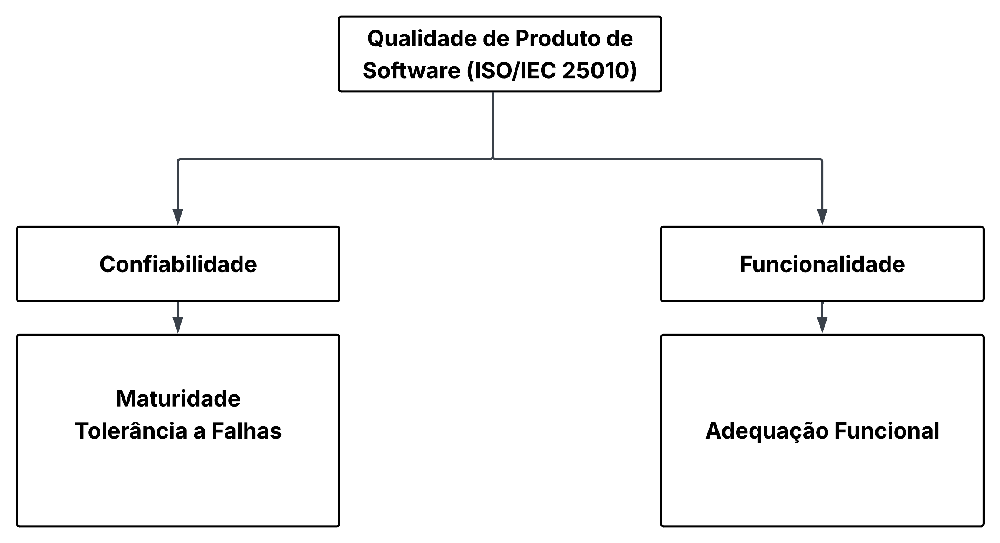

# Fase 1 - Modelo de Qualidade e Escopo

## Introdução

O objetivo desta etapa é apresentar o modelo de qualidade **ISO/IEC 25010**, destacando as duas características escolhidas pelo grupo: **Confiabilidade e Adequação Funcional**. A partir delas, buscamos definir o que será analisado e até que ponto essa análise irá aprofundar cada característica.

## Diagrama

O diagrama abaixo apresenta o **modelo ISO/IEC 25010** com as características selecionadas para a Fase 1, bem como as respectivas subcaracterísticas.

<strong>Imagem 1: Diagrama do modelo ISO/IEC 25010</strong>

<em>Autores: Arthur Guilherme e Tiago Lemes </em>

## Escopo

Nesta avaliação, analisaremos apenas as características de **Confiabilidade e Adequação Funcional**, conforme definidas pela ISO/IEC 25010. As demais características do modelo, embora relevantes, não farão parte do escopo desta fase.

Além disso, nem todas as subcaracterísticas associadas a essas características foram selecionadas. Optou-se por incluir apenas aquelas mais adequadas ao contexto do projeto e mais relevantes para a análise pretendida.

Dessa forma, definiu-se por um escopo reduzido, visando **garantir uma avaliação mais aprofundada e metodologicamente consistente**. A inclusão de um número muito grande de características e subcaracterísticas poderia comprometer a profundidade da investigação, enquanto concentrar a análise em pontos específicos permite trabalhar com maior detalhamento e clareza.

## Adaptação ao Modelo

O modelo ISO/IEC 25010 foi adaptado para priorizar os aspectos mais críticos ao propósito desta avaliação: garantir a **confiabilidade** do sistema AGIO e a **completude e corretude de suas funcionalidades essenciais**.

A seleção das características considerou o cenário de uso do AGIO, um sistema web de inventário utilizado para gerenciar itens, usuários e registros em banco de dados, levando em conta a necessidade de assegurar que o sistema opere de forma previsível, estável e correta durante o uso.

### Confiabilidade

Refere-se à capacidade do sistema AGIO de executar suas operações fundamentais (login, CRUD de itens, exportação CSV, controle de acesso, persistência de dados) sem apresentar falhas, interrupções inesperadas ou inconsistências nos dados.

> A tabela a seguir apresenta a classificação das subcaracterísticas de Confiabilidade do modelo SQuaRE (ISO/IEC 25010), utilizando a matriz Impacto × Risco para apoiar a priorização.

<strong>Tabela 1: Classificação das subcaracterísticas de Confiabilidade</strong>

|Subcaracterística de Confiabilidade (SQuaRE)| Impacto | Risco |Justificativa |
|--------|--------|--------|--------|
|**Maturidade**| Alto | Alto | Avalia a ocorrência de erros durante operações como login, edição, remoção de itens e consultas ao banco, pois falhas comprometem o fluxo do usuário e a estabilidade do inventário |
|**Tolerância a Falhas**| Alto | Alto | Avalia a capacidade do AGIO de continuar operando como esperado mesmo diante de erros, entradas inválidas, falhas de hardware e software ou tentativas de acesso inadequadas. |
|**Disponibilidade**| Alto | Alto | Avalia a capacidade do sistema de permanecer operacional e acessível aos usuários |
|**Recuperabilidade**| Médio | Alto | Avalia a capacidade de o sistema retornar ao funcionamento normal após falhas |

<em>Autores: Arthur Guilherme e Tiago Lemes </em>

Para o escopo do projeto, selecionamos apenas as subcaracterísticas **Maturidade e Tolerância a Falhas**, pois ambas representam os aspectos mais diretamente observáveis e críticos do comportamento do AGIO no estado atual. Essas subcaracterísticas permitem avaliar a frequência de falhas e a resposta do sistema a situações inesperadas, dois fatores essenciais para compreender a estabilidade operacional e a robustez mínima necessária para o uso cotidiano do inventário. Além disso, são elementos cuja análise não depende de monitoramento contínuo, podendo ser examinados mesmo diante das limitações técnicas apresentadas pelo ambiente.

As demais subcaracterísticas, **Recuperabilidade e Disponibilidade** não foram avaliadas nesta fase porque o ambiente analisado (instância atual do AGIO) apresenta **erro 500: INTERNAL_SERVER_ERROR** persistente, impedindo medições contínuas de uptime, comportamento após falhas e mecanismos de recuperação. Embora essas características possam ser medidas em um ambiente local, optamos por não adicioná-las ao escopo da Fase 1.

### Adequação Funcional

Refere-se ao grau em que o AGIO entrega corretamente as funcionalidades previstas, incluindo autenticação, gerenciamento de inventário, controle de acesso e exportação de dados.

> A tabela a seguir apresenta a classificação das subcaracterísticas de Adequação Funcional do modelo SQuaRE (ISO/IEC 25010), utilizando a matriz Impacto × Risco para apoiar a priorização.

<strong>Tabela 2: Classificação das subcaracterísticas de Adequação Funcional</strong>

|Subcaracterística de Confiabilidade (SQuaRE)| Impacto | Risco |Justificativa |
|--------|--------|--------|--------|
| **Completude Funcional** | Alto | Alto | Avalia em que medida o conjunto de funções do sistema cobre todas as tarefas especificadas e os objetivos dos usuários. |
| **Corretude Funcional** | Alto | Médio | Avalia se o sistema fornece resultados corretos, com o nível de precisão necessário para cada funcionalidade. |
| **Conformidade Funcional** | Médio | Médio | Avalia em que medida as funcionalidades facilitam a realização das tarefas e objetivos especificados pelo usuário |

<em>Autores: Arthur Guilherme e Tiago Lemes </em>

Para o escopo do projeto, selecionamos as subcaracterísticas **Completude Funcional e Corretude Funcional**, pois ambas permitem avaliar não apenas se o AGIO disponibiliza as funcionalidades necessárias para cumprir as tarefas e objetivos especificados, mas também se essas funcionalidades produzem resultados corretos e com o grau de precisão adequado. Dessa forma, o escopo combina a verificação da cobertura das funções com a validade dos resultados, oferecendo uma análise funcional mais abrangente.

A subcaracterística **Conformidade Funcional** não foi incluída nesta fase porque sua avaliação demanda analisar o quanto cada funcionalidade efetivamente facilita as tarefas do usuário, o que requer estudos de uso mais aprofundados, como testes de usabilidade ou observação direta de cenários reais. Como o foco atual está em avaliar o comportamento funcional observado e a correção dos resultados, a verificação da pertinência foi retirada do escopo de análise.

## Referências Bibliográficas

> ISO. ISO/IEC 25010 — ISO 25000 Software and Data Quality. Disponível em: [ISO/IEC 25010](https://iso25000.com/index.php/en/iso-25000-standards/iso-25010). Acesso em: 11 mai. 2026.

## **Histórico de Versão**

| ID | Descrição | Autor | Data | Revisor | Data |
|:--:|:---------|:------|:--------|:--------|:----:|
| 01 | Criação do documento e documentação da Introdução, Escopo e Referências Bibliográficas | [Tiago Lemes](https://github.com/TiagoTeixeira-2005) | 11/05/2026 | [Arthur Guilherme](https://github.com/ArthurGuilher62) | 11/05/2026 |
| 02 | Documentação do Diagrama e da Adaptação do Modelo | [Arthur Guilherme](https://github.com/ArthurGuilher62) | 11/05/2026 | [Tiago Lemes](https://github.com/TiagoTeixeira-2005) | 12/05/2026 |
| 03 | Atualização da documentação da Adaptação do Modelo | [Tiago Lemes](https://github.com/TiagoTeixeira-2005) | 12/05/2026 | [Arthur Guilherme](https://github.com/ArthurGuilher62) | 12/05/2026 |
| 04 | Correção da característica de Adequação Funcional | [Tiago Lemes](https://github.com/TiagoTeixeira-2005) | 18/05/2026 |  |  |

