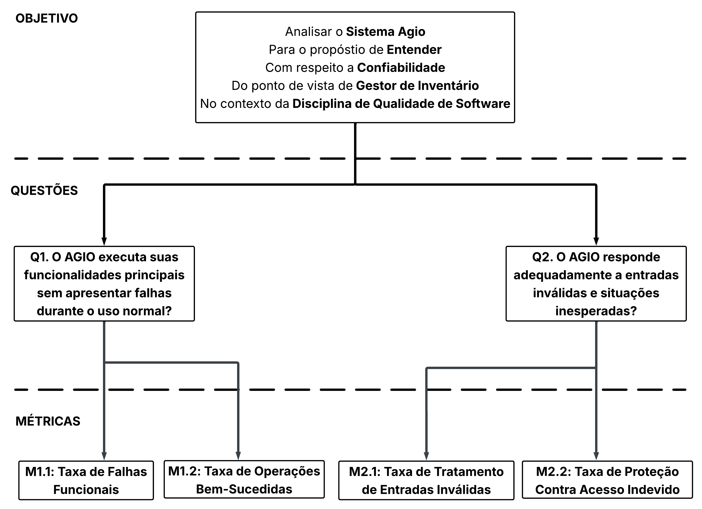

# Fase 2 - Confiabilidade

## Introdução

Este artefato tem como objetivo aplicar a abordagem [GQM (Goal-Question-Metric)](https://fcte-qualidade-de-software-1.github.io/2026-1_T02_ELIZABETH_FRIEDMAN/fase2/fase2/) para analisar a confiabilidade do sistema [AGIO (Aplicação de Gestão de Inventário Otimizada)](https://github.com/unb-mds/2024-2-Agio). A ideia é definir objetivos, perguntas e métricas que ajudem a avaliar o comportamento do sistema durante o uso, identificando possíveis falhas e verificando como ele reage a situações inesperadas.

A análise foi baseada nas subcaracterísticas de Confiabilidade selecionadas na Fase 1 do projeto: *Maturidade e Tolerância a Falhas*.

## Metodologia

Para realizar esta avaliação, foi utilizada a abordagem GQM (Goal-Question-Metric), uma metodologia que segue uma estratégia top-down (de cima para baixo), na qual, primeiramente, é definido um objetivo de medição. Em seguida, são elaboradas perguntas relacionadas aos aspectos que se deseja avaliar e, por fim, são estabelecidas métricas capazes de fornecer dados para responder a essas perguntas e verificar se as hipóteses definidas são válidas.

## Descrição do Objetivo de Medição de Confiabilidade

<strong>Tabela 1: Descrição do Objetivo de Medição de Qualidade</strong>

| **Dimensão** | **Descrição** |
| :--- | :--- |
| **Analisar** | Sistema AGIO | 
| **Para o propósito de** | Entender | 
| **Com respeito** | Confiabilidade | 
| **Da perspectiva do** | Gestor de Inventário | 
| **No contexto de** | Disciplina de Qualidade de Software | 

<em>Autor: Arthur Guilherme, João Igor e Tiago Lemes</em>

## Questões e Métricas

Com base nas subcaracterísticas de Confiabilidade escolhidas na [Fase 1](https://fcte-qualidade-de-software-1.github.io/2026-1_T02_ELIZABETH_FRIEDMAN/fase1/5-modelo/), foram definidas 2 perguntas para orientar a avaliação.

### Q1. O AGIO executa suas funcionalidades principais sem apresentar falhas durante o uso normal?

**Hipótese (H1):** Espera-se que o AGIO apresente comportamento estável durante operações rotineiras, como login, cadastro, edição, remoção de itens e exportação CSV, registrando poucas falhas durante sua utilização.
Esta hipótese será testada utilizando as seguintes métricas.
#### Métrica 1.1: Taxa de Falhas Funcionais 

> **Fórmula**
> 
> - Taxa de Falhas = (N° de falhas / N° total de operações) x 100
> 
> **Operações Consideradas**
> 
> - Serão consideradas as operações de Login, Cadastro de item, Edição de item, Remoção de item, Consulta de inventário e Exportação CSV
>
> **Interpretação**
> 
> - **Alta Maturidade (H1 Confirmada):** < 2%
> - **Média Maturidade:** 2% – 5%
> - **Baixa Maturidade (H1 Refutada :** > 5% 

#### Métrica 1.2: Taxa de Operações Bem-Sucedidas 

> **Fórmula**
> 
> - Taxa de Sucesso= (N° de operações concluídas com sucesso / N° total de operações) x 100
> 
> **Operações Consideradas**
> 
> - Assim como realizado na Métrica 1.1, serão consideradas as operações de Login, Cadastro de item, Edição de item, Remoção de item, Consulta de inventário e Exportação CSV
>
> **Interpretação**
> 
> - **Alta Maturidade (H1 Confirmada):** > 98%
> - **Média Maturidade:** 90% – 98%
> - **Baixa Maturidade (H1 Refutada :** < 90%

### Q2. O AGIO responde adequadamente a entradas inválidas e situações inesperadas?

**Hipótese (H2):** Espera-se que o sistema trate erros de entrada, tentativas de acesso indevido e operações inválidas sem encerrar sua execução ou comprometer os dados armazenados.

Esta hipótese será testada utilizando as seguintes métricas.

#### Métrica 2.1: Taxa de Tratamento de Entradas Inválidas

> **Fórmula**
> 
> - Taxa de Tratamento= (N° de entradas inválidas tratadas / N° total de entradas inválidas) x 100
> 
> **Cenários avaliados**
> 
> - Serão considerados os cenários de campos obrigatórios vazios, dados fora do formato esperado, valores inválidos e dados duplicados. 
>
> **Interpretação**
> 
> - **Alta Tolerância a Falhas (H2  Confirmada):** > 95% 
> - **Média Maturidade:** 80% – 95% 
> - **Baixa Maturidade (H2  Refutada):** < 80%  

#### Métrica 2.2: Taxa de Proteção Contra Acesso Indevido

> **Fórmula**
> 
> - Taxa de Proteção= (N° de tentativas bloqueadas / N° total de tentativas indevidas) x 100
> 
> **Cenários avaliados**
> 
> - Serão considerados os cenários de acesso sem autenticação, acesso direto por URL protegida, tentativas de acesso com permissões insuficientes e sessão expirada. 
>
> **Interpretação**
> 
> - **Alta Tolerância a Falhas (H2  Confirmada):** > 95% 
> - **Média Maturidade:** 80% – 95% 
> - **Baixa Maturidade (H2  Refutada):** < 80%  

## Modelo GQM

<strong>Imagem 1: Modelo GQM de Confiabilidade</strong>

<em>Autores: Arthur Guilherme, João Igor e Tiago Lemes </em>

## Conclusão

A utilização do método GQM permitiu transformar o conceito abstrato de **Confiabilidade** em um plano de avaliação objetivo para o AGIO. Considerando as limitações do ambiente atual, foram selecionadas as subcaracterísticas **Maturidade e Tolerância a Falhas**, por serem os aspectos mais relevantes e observáveis durante a execução local do sistema.

As métricas definidas possibilitam avaliar quantitativamente a estabilidade das funcionalidades essenciais do AGIO, como autenticação, gerenciamento de inventário e exportação de dados, bem como sua capacidade de lidar com erros de entrada e tentativas de acesso inadequadas.

Os resultados obtidos a partir dessas métricas poderão indicar o nível de confiabilidade do sistema e servir como base para a [Fase 3](https://fcte-qualidade-de-software-1.github.io/2026-1_T02_ELIZABETH_FRIEDMAN/fase3/fase3/).

## Referências Bibliográficas

> ISO/IEC. ISO/IEC 25010:2011 – **Systems and software engineering — Systems and software Quality Requirements and Evaluation (SQuaRE) — System and software quality models**. Geneva: International Organization for Standardization, 2011.
>
> PRESSMAN, Roger S.; MAXIM, Bruce R. **Engenharia de Software: uma abordagem profissional**. 9. ed. Porto Alegre: AMGH, 2021.
>
> SOMMERVILLE, Ian. **Engenharia de Software**. 10. ed. São Paulo: Pearson, 2019.
>
> BASILI, Victor R.; CALDIERA, Gianluigi; ROMBACH, H. Dieter. **The Goal Question Metric Approach**. Encyclopedia of Software Engineering. New York: Wiley, 1994.

## Histórico de Versão

| ID | Descrição | Autor | Data | Revisor | Data |
|:--:|:---------|:------|:--------|:--------|:----:|
| 01 | Criação do documento | [Tiago Lemes](https://github.com/TiagoTeixeira-2005) | 02/06/2026 |  |  |
| 02 | Documentação inicial das questões e métricas | [Tiago Lemes](https://github.com/TiagoTeixeira-2005) | 03/06/2026 |  |  |
