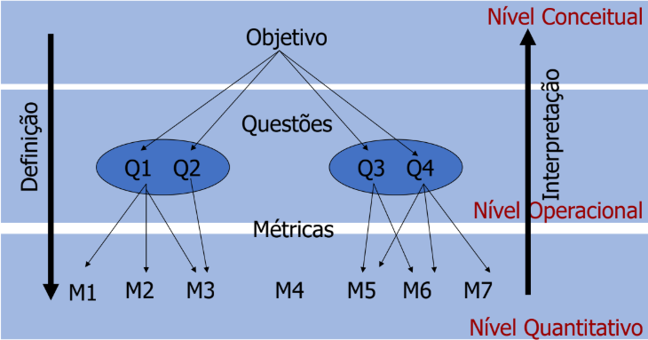

# Fase 2 - Introdução

## Introdução

Nesta etapa, adotou-se a abordagem **GQM (Goal-Question-Metric)**, uma metodologia que segue uma estratégia top-down (de cima para baixo), na qual a equipe inicia com a definição dos objetivos, formula questões para avaliar o alcance desses objetivos e identifica métricas capazes de fornecer respostas mensuráveis. 

Dessa forma, os objetivos de qualidade são traduzidos em indicadores concretos, possibilitando uma análise prática e estruturada da qualidade do software que, no escopo deste trabalho, corresponde ao AGIO (Aplicação de Gestão de Inventário Otimizada).

## Representação do  GQM

Conforme ilustrado na *Figura 1*, o GQM estabelece um fluxo hierárquico top-down que conecta os objetivos estratégicos aos dados coletados, criando uma cadeia de rastreabilidade na qual as **Métricas** fornecem respostas às **Questões**, e as **Questões**, em conjunto, permitem verificar se o **Objetivo** foi alcançado.

De forma geral, a estrutura do GQM é dividida em três níveis distintos:

- **Nível Conceitual (Goal / Objetivo):** Estabelece o objetivo principal que se deseja alcançar.
- **Nível Operacional (Question / Questão):** Detalha o que é necessário saber para determinar se o objetivo foi atingido. As questões decompõem a meta abstrata em componentes específicos e investigáveis, considerando uma determinada perspectiva de análise.
- **Nível Quantitativo (Metric / Métrica):** Define as métricas que fornecem os dados quantitativos necessários para responder objetivamente a cada questão, estabelecendo como cada aspecto será medido.

<strong>Imagem 1: Imagem Ilustrativa do GQM</strong>

<strong>Autor: Slides disponibilizados pela professora</strong>

## Artefatos

## Histórico de Versão

| ID | Descrição | Autor | Data | Revisor | Data |
|:--:|:---------|:------|:--------|:--------|:----:|
| 01 | Criação do documento | [Tiago Lemes](https://github.com/TiagoTeixeira-2005) | 02/06/2026 |  |  |
