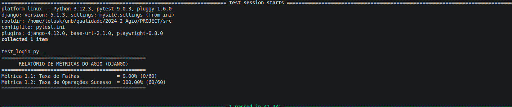
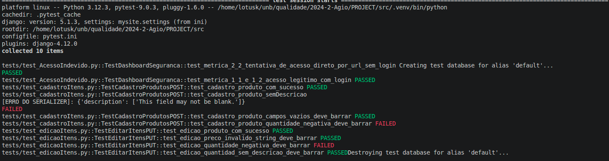
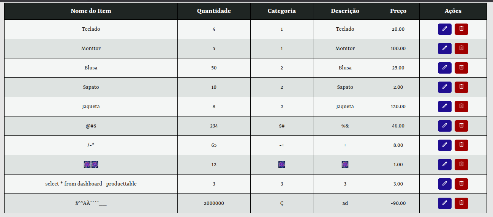
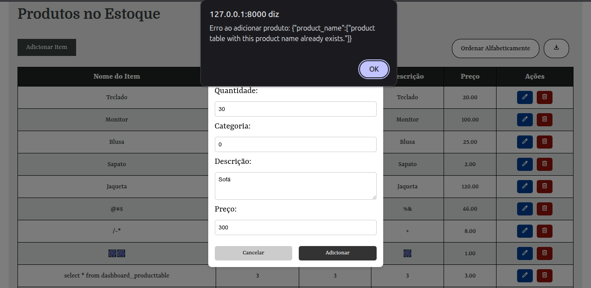
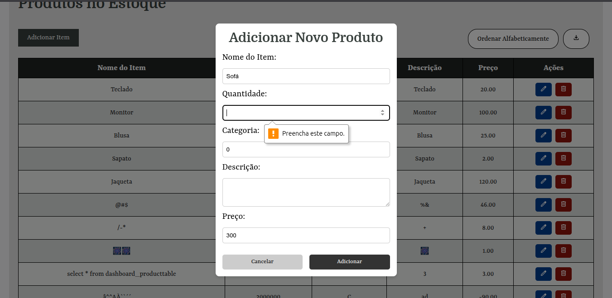
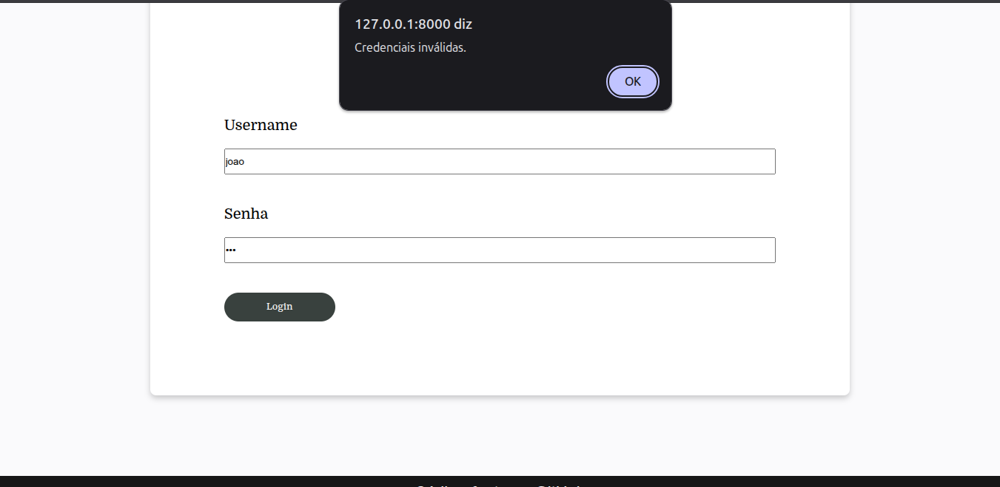
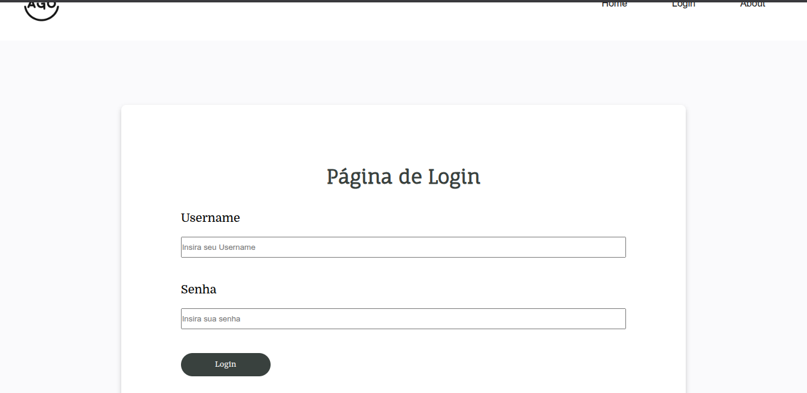

# Fase 4 - Confiabilidade

## Procedimento Executado

A avaliação da Confiabilidade do sistema AGIO foi conduzida com base na abordagem GQM (Goal-Question-Metric) definida na [Fase 2](https://fcte-qualidade-de-software-1.github.io/2026-1_T02_ELIZABETH_FRIEDMAN/fase2/2-confiabilidade/) e no plano de coleta estabelecido na [Fase 3](https://fcte-qualidade-de-software-1.github.io/2026-1_T02_ELIZABETH_FRIEDMAN/fase3/2-confiabilidade/). O objetivo da avaliação foi verificar a capacidade do sistema de operar de forma estável, consistente e segura, considerando as subcaracterísticas de **Maturidade** e **Tolerância a Falhas**.

O procedimento consistiu em duas frentes principais de investigação:

1. **Avaliação da Maturidade do Sistema:** Foram executadas operações representativas do fluxo principal de utilização da aplicação, incluindo login, cadastro de itens, edição de registros, remoção de itens, consulta ao inventário e exportação de relatórios CSV. O objetivo foi verificar a estabilidade operacional do sistema e identificar possíveis falhas durante a execução dessas funcionalidades.

   * **Fluxo Principal de Operação:** Cada funcionalidade foi executada dez vezes, totalizando sessenta operações avaliadas. Durante os testes, observou-se que o sistema executou corretamente as operações de cadastro, edição, remoção, consulta e exportação, mantendo a integridade dos dados e o comportamento esperado.
   * **Validação da Autenticação:** Também foram realizados testes com credenciais válidas e inválidas. O sistema permitiu corretamente o acesso de usuários autenticados e rejeitou tentativas de login com informações incorretas.

2. **Avaliação da Tolerância a Falhas:** Foram conduzidos testes voltados à análise do comportamento do sistema diante de entradas inválidas e tentativas de utilização inadequada da aplicação.

   * **Tratamento de Entradas Inválidas:** Foram simulados cenários envolvendo campos obrigatórios vazios, preenchimento com formatos incorretos, valores inválidos, dados duplicados e utilização de caracteres especiais. O objetivo foi verificar a capacidade do sistema de identificar e tratar erros sem comprometer seu funcionamento.
   * **Proteção Contra Acessos Indevidos:** Foram simulados acessos a páginas protegidas sem autenticação, acesso direto por URL a funcionalidades restritas, utilização de sessões expiradas e tentativas de execução de operações administrativas sem privilégios adequados. O comportamento esperado era o bloqueio das tentativas e a aplicação correta das regras de autenticação e autorização.

---

## Medição (Dados Coletados)

Nesta seção são apresentados os resultados obtidos a partir da aplicação das métricas definidas na [Fase 2](https://fcte-qualidade-de-software-1.github.io/2026-1_T02_ELIZABETH_FRIEDMAN/fase2/2-confiabilidade/). Para cada métrica, são demonstrados os dados coletados, o cálculo realizado e a interpretação do resultado obtido.

### M1.1 - Taxa de Falhas Funcionais (TFF)

A métrica avalia a proporção de falhas identificadas durante a execução das operações do sistema em relação ao total de operações realizadas.

<strong>Tabela 1: Avaliação da Taxa de Falhas Funcionais</strong>

| Ação | Quantidade Executada | Falhas Observadas | Observações |
|:--|:--:|:--:|:--|
| Login | 60 | 0 | Autenticação executada corretamente com credenciais válidas e rejeitada com credenciais inválidas. |
| Cadastro de Item | 16 | 2 | falhas: permite cadastro de quantidade negativa de estoque e não permite  descrição vazia. |
| Edição de Item | 16 | 1 | falha: permite cadastro de quantidade negativa de estoque. |
| Remoção de Item | 10 | 0 | Operação executada sem falhas. |
| Consulta de Inventário | 10 | 0 | Operação executada sem falhas. |
| Exportação CSV | 10 | 0 | Foi identificado um comportamento inesperado em uma execução. |

<em>Autores: Arthur Guilherme, João Igor e Tiago Lemes</em>

**Resultado da Métrica:**

- Número total de operações: 122
- Número de falhas identificadas: 3

> TFF = (3 / 122) × 100 = 2,46%

O resultado demonstra que a incidência de falhas foi baixa durante a execução das funcionalidades avaliadas.

---

### M1.2 - Taxa de Operações Bem-Sucedidas (TOBS)

A métrica avalia a proporção de operações concluídas com sucesso em relação ao total de operações realizadas.

<strong>Tabela 2: Avaliação da Taxa de Operações Bem-Sucedidas</strong>

| Ação | Quantidade Executada | Operações Bem-Sucedidas |
|:--|:--:|:--:|
| Login | 60 | 60 |
| Cadastro de Item | 16 | 14 |
| Edição de Item | 16 | 15 |
| Remoção de Item | 10 | 10 |
| Consulta de Inventário | 10 | 10 |
| Exportação CSV | 10 | 10 |

<em>Autores: Arthur Guilherme, João Igor e Tiago Lemes</em>

**Resultado da Métrica:**

- Operações concluídas com sucesso: 119
- Total de operações realizadas: 122

> TOBS = (119 / 122) × 100 = 97,54%

O resultado evidencia que todas as operações planejadas foram concluídas corretamente durante os testes realizados.

<strong>Imagem 1: Teste das Métricas 1.1 e 1.2</strong>

<em>Autores: Arthur Guilherme, João Igor e Tiago Lemes</em>

<strong>Imagem 2: Teste das Métricas 1.1 e 1.2</strong>

<em>Autores: Arthur Guilherme, João Igor e Tiago Lemes</em>

<strong>Imagem 3: Teste Manual das Métricas 1.1 e 1.2</strong>

<em>Autores: Arthur Guilherme, João Igor e Tiago Lemes</em>

---

### M2.1 - Taxa de Tratamento de Entradas Inválidas (TTEI)

A métrica avalia a capacidade do sistema de identificar e tratar adequadamente entradas inválidas fornecidas pelos usuários.

<strong>Tabela 3: Avaliação da Taxa de Tratamento de Entradas Inválidas</strong>

| Cenário Testado | Quantidade | Tratado Corretamente | Observações |
|:--|:--:|:--:|:--|
| Campos Obrigatórios Vazios | 10 | 10 | Sistema solicitou preenchimento dos campos obrigatórios. |
| Dados Fora do Formato Esperado | 10 | 10 | Sistema apresentou mensagens de validação adequadas. |
| Valores Inválidos | 10 | 0 | Sistema aceitou valores incompatíveis com a regra de negócio. |
| Dados Duplicados | 10 | 10 | Sistema impediu o cadastro duplicado. |
| Caracteres Inválidos | 10 | 0 | Sistema aceitou entradas sem validação específica. |

<em>Autores: Arthur Guilherme, João Igor e Tiago Lemes</em>

**Resultado da Métrica:**

- Entradas inválidas tratadas corretamente: 30
- Total de entradas inválidas testadas: 50

> TTEI = (30 / 50) × 100 = 60%

Os resultados indicam que o sistema possui mecanismos básicos de validação, porém apresenta limitações relacionadas ao tratamento de valores inválidos e caracteres especiais.

<strong>Imagem 4: Teste da Métrica 2.1 </strong>

<em>Autores: Arthur Guilherme, João Igor e Tiago Lemes</em>

<strong>Imagem 5: Teste da Métrica 2.1 </strong>

<em>Autores: Arthur Guilherme, João Igor e Tiago Lemes</em>

<strong>Imagem 6: Teste da Métrica 2.1 </strong>

<em>Autores: Arthur Guilherme, João Igor e Tiago Lemes</em>

---

### M2.2 - Taxa de Proteção Contra Acesso Indevido (TPAI)

A métrica avalia a eficácia dos mecanismos de autenticação e autorização na prevenção de acessos não autorizados.

<strong>Tabela 4: Avaliação da Taxa de Proteção Contra Acesso Indevido</strong>

| Cenário Testado | Quantidade | Bloqueios Realizados | Observações |
|:--|:--:|:--:|:--|
| Acesso sem autenticação | 10 | 10 | Usuário redirecionado para login. |
| Acesso direto por URL | 10 | 10 | Acesso bloqueado corretamente. |
| Usuário sem privilégios administrativos | 10 | 10 | Acesso negado conforme esperado. |
| Sessão expirada | 10 | 10 | Sistema exigiu nova autenticação. |
| Operações administrativas sem permissão | 10 | 10 | Operações bloqueadas corretamente. |

<em>Autores: Arthur Guilherme, João Igor e Tiago Lemes</em>

**Resultado da Métrica:**

- Tentativas indevidas bloqueadas: 50
- Total de tentativas indevidas realizadas: 50

> TPAI = (50 / 50) × 100 = 100%

O sistema apresentou comportamento consistente em todos os cenários avaliados, bloqueando corretamente acessos não autorizados.

<strong>Imagem 7: Teste da Métrica 2.2 </strong>

<em>Autores: Arthur Guilherme, João Igor e Tiago Lemes</em>

<strong>Imagem 8: Teste da Métrica 2.2 </strong>

<em>Autores: Arthur Guilherme, João Igor e Tiago Lemes</em>

---

## Análise e Julgamento

Os resultados obtidos indicam que o AGIO apresenta um nível intermediário de confiabilidade em seus fluxos principais de operação. As métricas relacionadas à subcaracterística **Maturidade** demonstraram comportamento consistente durante a execução das funcionalidades avaliadas, porém sem atingir o nível de alta maturidade, uma vez que tanto a Taxa de Falhas Funcionais quanto a Taxa de Operações Bem-Sucedidas foram classificadas como de maturidade média. Isso evidencia uma estabilidade operacional satisfatória, ainda que abaixo do nível esperado para confirmação de alta maturidade.

Por outro lado, a avaliação da subcaracterística **Tolerância a Falhas** revelou um desempenho heterogêneo. Enquanto a Taxa de Proteção Contra Acesso Indevido atingiu o nível de alta maturidade, demonstrando eficácia dos mecanismos de autenticação e autorização, a Taxa de Tratamento de Entradas Inválidas apresentou baixo desempenho, ficando abaixo do critério estabelecido. Assim, observa-se que o sistema ainda apresenta limitações no tratamento consistente de entradas inválidas, embora consiga lidar adequadamente com tentativas de acesso indevido.

### Respostas às Questões GQM

**Q1. O sistema AGIO executa suas funcionalidades de forma estável e consistente durante sua operação normal?**

**Resposta:** Sim. A Taxa de Falhas Funcionais foi de 2,46%, enquadrando-se no nível de maturidade média (2%–5%), enquanto a Taxa de Operações Bem-Sucedidas foi de 97,54%, também classificada como maturidade média (90%–98%). Dessa forma, o sistema apresenta nível de maturidade intermediário, confirmando a hipótese em nível de maturidade média (H1).

**Q2. O sistema AGIO é capaz de lidar adequadamente com situações de erro e tentativas de uso inadequado?**

**Resposta:** Parcialmente. Embora a Taxa de Proteção Contra Acesso Indevido tenha alcançado 100%, a Taxa de Tratamento de Entradas Inválidas foi de apenas 60%, valor inferior ao critério definido (> 95%). Portanto, a hipótese relacionada à Tolerância a Falhas (H2) é parcialmente confirmada.

### Resumo dos Resultados

<strong>Tabela 5: Resumo dos Resultados das Métricas</strong>

| Métrica | Objetivo | Valor Obtido | Critério Desejado | Resultado da Métrica |
|----------|----------|:----------:|:----------:|:----------:|
| M1.1 Taxa de Falhas Funcionais | Avaliar a incidência de falhas durante a execução das operações. | 2,46% | < 2% | **MÉDIA MATURIDADE** |
| M1.2 Taxa de Operações Bem-Sucedidas | Avaliar a estabilidade operacional do sistema. | 97,54% | > 98% | **MÉDIA MATURIDADE** |
| M2.1 Taxa de Tratamento de Entradas Inválidas | Avaliar a capacidade de tratamento de erros de entrada. | 60% | > 95% | **BAIXA TOLERÂNCIA A FALHAS** |
| M2.2 Taxa de Proteção Contra Acesso Indevido | Avaliar a eficácia dos mecanismos de autenticação e autorização. | 100% | > 95% | **ALTA TOLERANCIA A FALHAS** |

<em>Autores: Arthur Guilherme, João Igor e Tiago Lemes</em>

<strong>Tabela 6: Resumo dos Resultados das Hipóteses</strong>

| Hipóteses | Descrição | Métricas relacionadas | Resultado das Hipóteses |
|-----------|-----------|:---------------------:|:--------------------:|
| H1 | Espera-se que o AGIO apresente comportamento estável durante operações rotineiras, como login, cadastro, edição, remoção de itens e exportação CSV, registrando poucas falhas durante sua utilização. Esta hipótese será testada utilizando as seguintes métricas | M1.1, M1.2 | **CONFIRMADA EM NÍVEL DE MATURIDADE MÉDIA** |
| H2 | Espera-se que o sistema trate erros de entrada, tentativas de acesso indevido e operações inválidas sem encerrar sua execução ou comprometer os dados armazenados | M2.1, M2.2 | **PARCIALMENTE CONFIRMADA** devido ao desempenho inconsistente entre as métricas |

<em>Autores: Arthur Guilherme, João Igor e Tiago Lemes</em>

## Histórico de Versão

| ID | Descrição | Autor | Data | Revisor | Data |
|:--:|:---------|:------|:--------|:--------|:----:|
| 01 | Criação do documento | [Tiago Lemes](https://github.com/TiagoTeixeira-2005) | 02/06/2026 |   [João Igor](https://github.com/JoaoPC10)| 12/06/2026 |
| 02 | Criação do documento |  [João Igor](https://github.com/JoaoPC10) | 02/06/2026 |   [Tiago Lemes](https://github.com/TiagoTeixeira-2005)| 12/06/2026 |
| 03 | adição de fotos de teste e reajuste de quantidade de dados |  [Arthur Guilherme](https://github.com/ArthurGuilher62) | 19/06/2026 |   [Tiago Lemes](https://github.com/TiagoTeixeira-2005)| 19/06/2026 |
| 04 | Adição do restantes das provas |  [João Igor](https://github.com/JoaoPC10) | 23/06/2026 |   [Tiago Lemes](https://github.com/TiagoTeixeira-2005)| 23/06/2026 |

